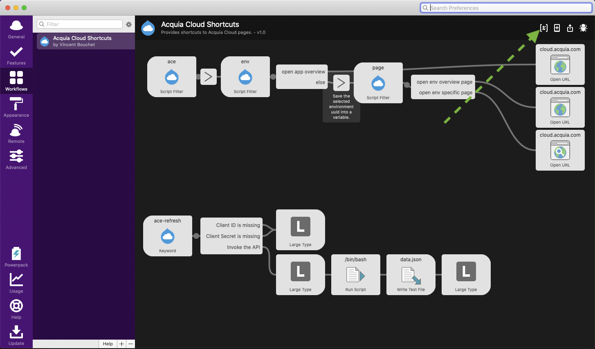
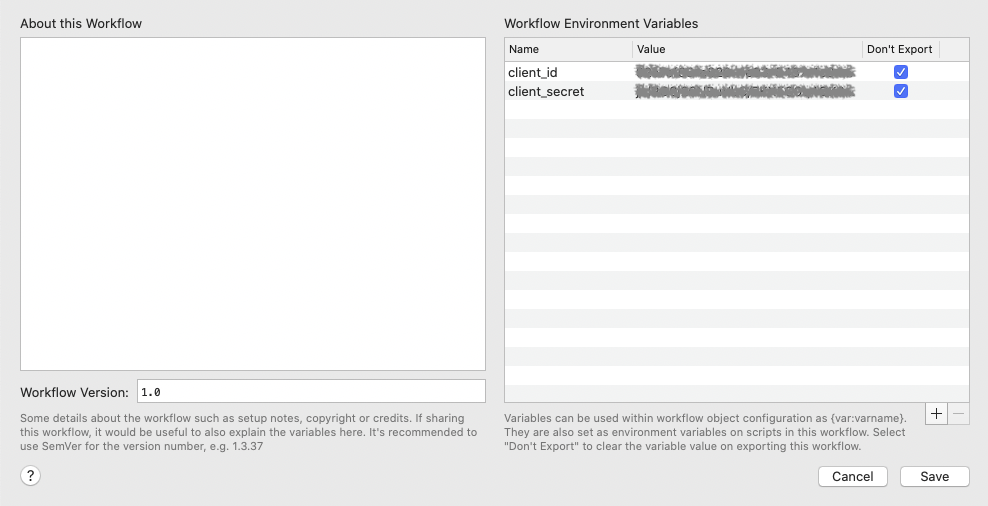

# Acquia Cloud Shortcuts workflow for Alfred

This is custom workflow for the [Alfred app][alfred-app] that lets you browse
the applications and environments which you have access on [Acquia Cloud][acquia-cloud].
It provides direct access to Acquia Cloud pages.

## Initial configuration
You'll need to create and provide an API token. To generate a new token, follow
the [official Acquia documentation][acquia-api-token-doc]
To provide these values, click the [x] icon at the top-right of the workflow
configuration view.



Then, add a client_id and a client_secret variables as shown in the following
screenshot.



In a similar maner, you need to provide the PATH to the NodeJS executable. Because Alfred is executed outside of any context, it does not know about you $PATH variable. Simply open your terminal, run `which node` and copy the result into the node variable (in the same interface than client_id and client_secret).

## Acquia Cloud data
To avoid latency due to the fetching of data from Acquia Cloud API, the data
are saved locally.
To fetch the data (first time or refresh), use the `ace-refresh` command within
Alfred.
It will generate a new `data.json` file into `~/Library/Application Support/Alfred/Workflow Data/vbouchet.workflow.acquia-cloud-shortcuts`.

### Override
Because the names used in Acquia Cloud UI may not be intuitive, because you may
want to hide some of the applications, because you may want to personalize the
way applications are listed, it is possible to override the data returned by the
API.
For this purpose, you need to create a `overwrite.json` file in `~/Library/Application Support/Alfred/Workflow Data/vbouchet.workflow.acquia-cloud-shortcuts`
This is an sample of what it is possible to do:
```
[
  {
    'uid': '1234',
    'title': 'A more fancy name',
    'icon': {
      'path': '~/Library/Application Support/Alfred/Workflow Data/vbouchet.workflow.acquia-cloud-shortcuts/icons/app1.png'
    }
  }
]
```
The application uid is what is named UUID in Acquia Cloud. It is visible when
accessing the page listing all the environments of an application. The url of
this page is `https://cloud.acquia.com/a/applications/<uuid>`.

The exhaustive list of properties which can be used is available on [Alfred
documentation][alfred-json-doc]

## Usage
The only command is `ace `. It will automatically list the applications you can
access. Start typing the first letters of an application to filter the list.
Press "Enter" to select the application. Next step is to select the environment
or to choose the "Application overview" entry which will open the application
page in the browser. The last step is to select which page (cron, logs, ...)
for the selected environment you want to visit.

## Contributing

You can submit your bug reports or feature requests at:
https://github.com/vbouchet31/alfred-acquia-cloud-shortcuts/issues

If you want to submit a Pull Request, please follow these simple guides:

1. Add a detailed description of what you're changing and why.
2. Don't increase the version of the workflow in your changes.

Here are some ideas for Pull Requests:

- [ ] Replace usage of NodeJS by some MacOS built-in language
- [ ] Enrich the list of pages
- [ ] Improve the wording
- [ ] Add support for ACSF applications

[alfred-app]: https://www.alfredapp.com/
[acquia-cloud]: https://cloud.acquia.com/
[acquia-api-token-doc]: https://docs.acquia.com/cloud-platform/develop/api/auth/#cloud-generate-api-token
[alfred-json-doc]: https://www.alfredapp.com/help/workflows/inputs/script-filter/json/
